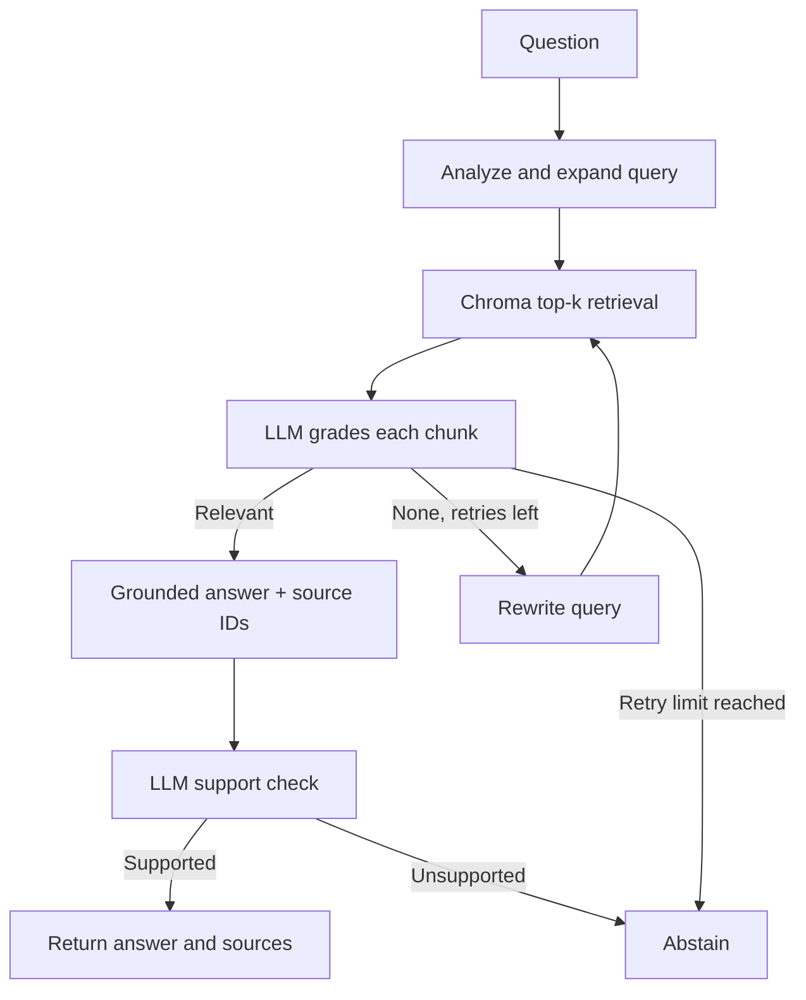

# Technical Documentation Assistant

A small, self-corrective RAG service for technical documentation. Built for the
Express Analytics AI/ML Engineer Intern assignment. It indexes four original
FastAPI study notes, retrieves semantically similar chunks with Chroma, grades
each retrieved chunk using an LLM, retries weak retrieval, and produces
source-marked answers through FastAPI.

The included corpus is paraphrased study notes with links to the [official
FastAPI docs](https://fastapi.tiangolo.com/tutorial/). The API also accepts
additional Markdown, text, HTML, or supported documentation URLs.

## Architecture



The `RAGState` in `app/workflow.py` carries the original question, current
search query, query type, attempt count, retrieved chunks, filtered relevant
chunks, answer, citations, verification result, and status. One initial retrieval plus two retries
is the default maximum. A failed relevance check never reaches generation.

## Requirements and setup

- Python 3.11 or newer
- An OpenAI API key with access to `gpt-4o-mini` and
  `text-embedding-3-small` (model names configurable)
- Internet for embedding/model calls; the Chroma index itself is local

```bash
python -m venv .venv
source .venv/bin/activate      # Windows PowerShell: .venv\Scripts\Activate.ps1
python -m pip install -r requirements.txt
cp .env.example .env           # Windows: copy .env.example .env
```

Set `OPENAI_API_KEY` in your environment. To load a locally edited `.env` file
on bash, run `set -a; source .env; set +a`. The application deliberately does
not read or commit a key automatically. On Windows PowerShell:
`$env:OPENAI_API_KEY="your-key"`.

```bash
python -m scripts.seed
uvicorn app.main:app --reload
```

Open `http://127.0.0.1:8000/docs` for the interactive API. The Chroma index
and SQLite feedback store live in `./data` and persist across restarts. Seed
is idempotent: it replaces chunks with the same source URL.

## API examples

```bash
curl -X POST http://127.0.0.1:8000/query \
  -H 'Content-Type: application/json' \
  -d '{"question":"How does FastAPI validate an integer path parameter?"}'
```

Representative response (model wording and ID vary):

```json
{
  "answer_id": "dce703d0-01be-49ae-836b-85e9a1785c18",
  "answer": "Annotate the route parameter as int so FastAPI parses and validates it [S1].",
  "sources": [{
    "marker": "S1",
    "title": "FastAPI path parameters",
    "source": "https://fastapi.tiangolo.com/tutorial/path-params/",
    "chunk_id": "7f9d...:0"
  }],
  "status": "answered",
  "retrieval_attempts": 1
}
```

Other endpoints:

```bash
curl -X POST http://127.0.0.1:8000/ingest \
  -H 'Content-Type: application/json' \
  -d '{"url":"https://fastapi.tiangolo.com/tutorial/query-params/"}'
curl -X POST http://127.0.0.1:8000/ingest -F 'file=@my-notes.md'
curl http://127.0.0.1:8000/documents
curl -X POST http://127.0.0.1:8000/feedback \
  -H 'Content-Type: application/json' \
  -d '{"answer_id":"dce703d0-01be-49ae-836b-85e9a1785c18","rating":"up","comment":"Useful"}'
```

`/query` returns an explicit `insufficient_context` status and no sources
when the graph cannot establish relevance after its bounded retries, when
generation lacks valid citations, or when the support check rejects its claims.
`/ingest` supports JSON URLs,
multipart URL fields, or one .md/.txt/.html upload. It limits content to 1 MB
and URL fetching to three official documentation hosts to avoid arbitrary
server-side requests. `/feedback` accepts `up` or `down` for a known
`answer_id`; subsequent feedback replaces the previous vote.

## Design decisions and tradeoffs

- **Chunking:** Paragraph-first chunks of at most 1,200 characters; only long
  paragraphs are split with 160-character overlap. This keeps technical
  statements and adjacent headings mostly together and avoids excessive
  duplication on short notes. A more complex corpus would benefit from
  Markdown-aware section paths and token-based chunking.
- **Embeddings:** `text-embedding-3-small` via Chroma's embedding function,
  with a persistent local index. This keeps the demo small but requires an API
  key and incurs provider costs. No provider key is included.
- **Grading and correction:** One binary LLM judgment per retrieved chunk. If
  none is relevant, the graph rewrites and retrieves again, for at most three
  total retrieval attempts. This makes the decision inspectable but costs more
  calls and may misclassify a borderline chunk.
- **Grounding:** Generation sees only graded chunks and must return inline
  source markers. The graph checks marker validity, then an independent LLM
  check evaluates whether every claim and citation is supported. Failure
  causes abstention. The support checker reduces risk but can still make
  errors; it is not a formal proof.
- **Persistence:** Chroma stores the indexed chunks; SQLite stores answer IDs
  and feedback. It is appropriate for a local single-process demo, not a
  multi-worker production deployment.
- **Assumptions:** A 1 MB limit and curated HTTPS host allowlist are sufficient
  for this technical-docs demo. Public authentication, rate limiting, and
  multi-tenant separation are outside the assignment scope.

The architecture separates retrieval, relevance judgment, answer writing, and
answer checking because each can fail in a different way. A nearest-neighbor
result might be about the wrong API; filtering it before generation is more
useful than merely asking the generator to be careful. A bounded rewrite loop
allows one recovery path without trapping a request indefinitely.

The optional web-search fallback, conversation memory, and Streamlit/Gradio UI
are not included. The assignment marks them as bonuses, and the core graph is
kept small enough to inspect. The optional support-check node is included.

With more time I would add a human-reviewed factual evaluation set, batched
grading, explicit document versioning, observability/cost metrics, OCR/PDF
ingestion, and a broader evaluation set with human-labeled questions.

## Tests

```bash
pytest -q
```

Tests cover the successful citation path, mixed relevance filtering, bounded
retries and abstention, malformed citation handling, support check, API
validation, ingestion, feedback, and a complete local API-to-Chroma flow with
only the external embedding/model calls stubbed. They do not assert that a
live provider key or external model is available. For a live smoke test, seed
the corpus and call `/query` with the example above.

## Repository layout

```text
app/main.py       FastAPI endpoints and SQLite feedback
app/workflow.py   LangGraph state, nodes, and conditional edges
app/store.py      Chroma persistence and chunking
app/llm.py        JSON model interface
app/ingest.py     Bounded official-URL ingestion
corpus/           Four original documentation notes and source manifest
scripts/seed.py   Idempotent corpus indexer
tests/            Graph and API behavior tests
```
