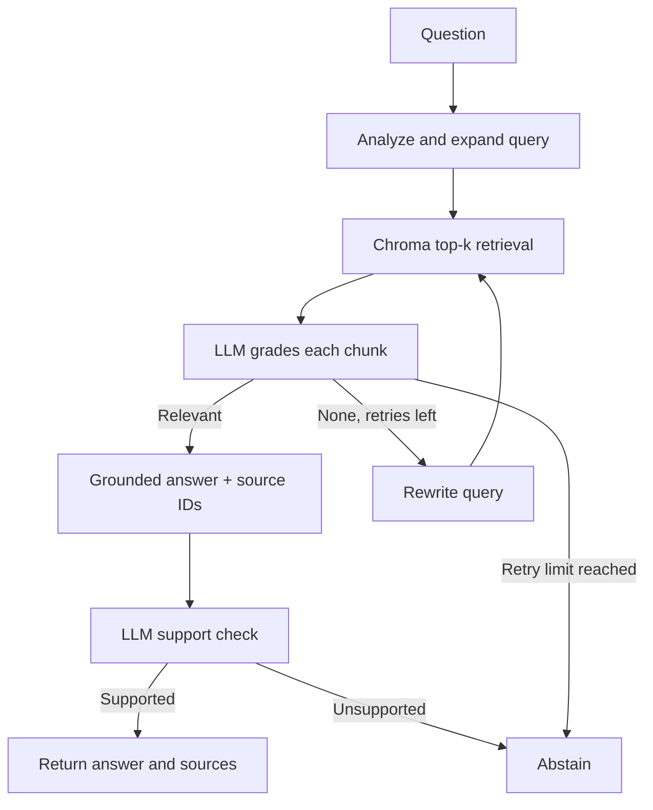

# Technical Documentation Assistant

A small, self-corrective RAG service for technical documentation. Built for the
Express Analytics AI/ML Engineer Intern assignment. It indexes four original
FastAPI study notes, retrieves semantically similar chunks with Chroma, grades
every retrieved chunk using an LLM, retries weak retrieval, and produces
source-marked answers through FastAPI. The local app also includes a small
browser interface for asking questions, inspecting sources, uploading notes,
and leaving feedback.

The included corpus is original study notes with links to the [official
FastAPI docs](https://fastapi.tiangolo.com/tutorial/). The API also accepts
additional Markdown, text, HTML, or supported documentation URLs.

## Assignment coverage

| PDF requirement | Implementation |
| --- | --- |
| 3-5 technical documents | Four original FastAPI notes in `corpus/`, with an official URL for each |
| LangGraph StateGraph | Query analysis, Chroma retrieval, LLM document grading, bounded rewrite, generation, support verification, and fallback in `app/workflow.py` |
| Grade every chunk and filter irrelevant ones | One JSON model request returns a judgment keyed by each retrieved chunk ID; missing judgments fail closed |
| Conditional routing and retry limit | Relevant chunks go to generation; otherwise rewrite and re-retrieve at most twice, then abstain |
| Ingestion, chunking, embeddings, vector store | `scripts/seed.py`, `app/ingest.py`, and `app/store.py`; provider embeddings and persistent Chroma |
| Four API endpoints | `POST /query`, `POST /ingest`, `GET /documents`, `POST /feedback` |
| Grounded response with citations | Generation uses only graded chunks; source markers are checked and a separate LLM node reviews support |
| Optional small interface | `GET /` serves a same-origin browser UI; `/docs` remains the interactive API |

## Architecture



The `RAGState` in `app/workflow.py` carries the original question, current
search query, query type, attempt count, retrieved chunks, filtered relevant
chunks, answer, citations, verification result, and status. One initial retrieval plus two retries
is the default maximum. A failed relevance check never reaches generation.
The default Gemini workflow uses four chat calls on a successful
single-pass question: query analysis, batch grading, answer generation, and
support checking. A short per-minute quota error is retried once after the
provider's suggested delay. Other provider quota limits return HTTP 429, and
additional retries can cost more requests.

## Requirements and setup

- Python 3.11 or newer
- A free-tier Gemini API key from [Google AI Studio](https://aistudio.google.com/apikey)
  for `gemini-3-flash-preview` and `gemini-embedding-2` (subject to Google's
  current free-tier availability and rate limits). An OpenAI API key is optional.
- Internet for embedding/model calls; the Chroma index itself is local

```bash
python -m venv .venv
source .venv/bin/activate      # Windows PowerShell: .venv\Scripts\Activate.ps1
python -m pip install -r requirements.txt
cp .env.example .env           # Windows: copy .env.example .env
```

Replace the placeholder `GEMINI_API_KEY` in the local `.env` file with your new
Gemini API key. Both the seed script and application load `.env` automatically.
The `.env` file is excluded from Git; keep your key out of GitHub and chat messages.

For OpenAI instead, set `AI_PROVIDER=openai`, `OPENAI_API_KEY`, and optionally
`OPENAI_CHAT_MODEL` and `OPENAI_EMBEDDING_MODEL`. Re-index into an empty `data`
directory when changing embedding providers or models; their vector dimensions
may differ. Gemini's free tier has per-project quotas, and some keys/projects
may have different model availability; check your AI Studio rate-limit page.

```bash
python -m scripts.seed
uvicorn app.main:app --reload
```

Open `http://127.0.0.1:8000/docs` for the interactive API. The Chroma index
and SQLite feedback store live in `./data` and persist across restarts. Seed
is idempotent: it replaces chunks with the same source URL.

For the visual interface, open `http://127.0.0.1:8000/`. It calls the same API
and does not place the provider key in the browser. If you edit any bundled
note, run `python -m scripts.seed` again to replace its indexed chunks.

On Windows PowerShell, the equivalent setup avoids activation-script policy
issues:

```powershell
py -m venv .venv
.\.venv\Scripts\python.exe -m pip install -r requirements.txt
Copy-Item .env.example .env
# Edit .env locally and replace only the GEMINI_API_KEY placeholder.
.\.venv\Scripts\python.exe -m scripts.seed
.\.venv\Scripts\python.exe -m uvicorn app.main:app --reload
```

## API examples

```bash
curl -X POST http://127.0.0.1:8000/query \
  -H 'Content-Type: application/json' \
  -d '{"question":"How does FastAPI validate an integer path parameter?"}'
```

Representative response (model wording and ID vary):

```json
{
  "answer_id": "dce703d0-01be-49ae-836b-85e9a1785c18",
  "answer": "Annotate the route parameter as int so FastAPI parses and validates it [S1].",
  "sources": [{
    "marker": "S1",
    "title": "FastAPI path parameters",
    "source": "https://fastapi.tiangolo.com/tutorial/path-params/",
    "chunk_id": "7f9d...:0"
  }],
  "status": "answered",
  "retrieval_attempts": 1
}
```

Other endpoints:

```bash
curl -X POST http://127.0.0.1:8000/ingest \
  -H 'Content-Type: application/json' \
  -d '{"url":"https://fastapi.tiangolo.com/tutorial/query-params/"}'
curl -X POST http://127.0.0.1:8000/ingest -F 'file=@my-notes.md'
curl http://127.0.0.1:8000/documents
curl -X POST http://127.0.0.1:8000/feedback \
  -H 'Content-Type: application/json' \
  -d '{"answer_id":"dce703d0-01be-49ae-836b-85e9a1785c18","rating":"up","comment":"Useful"}'
```

`/query` returns an explicit `insufficient_context` status and no sources
when the graph cannot establish relevance after its bounded retries, when
generation lacks valid citations, or when the support check rejects its claims.
Input validation errors return HTTP 422. Provider quota exhaustion returns
HTTP 429 with a safe category and provider status, without exposing key values.
`/ingest` supports JSON URLs,
multipart URL fields, or one .md/.txt/.html upload. It limits content to 1 MB
and URL fetching to three official documentation hosts to avoid arbitrary
server-side requests. `/feedback` accepts `up` or `down` for a known
`answer_id`; subsequent feedback replaces the previous vote.

## Design decisions and tradeoffs

- **Chunking:** Paragraph-first chunks of at most 1,200 characters; only long
  paragraphs are split with 160-character overlap. This keeps technical
  statements and adjacent headings mostly together and avoids excessive
  duplication on short notes. A more complex corpus would benefit from
  Markdown-aware section paths and token-based chunking.
- **Embeddings:** Gemini `gemini-embedding-2` by default, with explicit vectors
  stored in local Chroma; optional OpenAI `text-embedding-3-small`. Free-tier
  quotas vary and neither provider key is included.
- **Grading and correction:** One LLM call grades every retrieved chunk
  independently by ID. This reduces free-tier requests. If
  none is relevant, the graph rewrites and retrieves again, for at most three
  total retrieval attempts. This makes the decision inspectable but costs more
  calls and may misclassify a borderline chunk.
- **Grounding:** Generation sees only graded chunks and must return inline
  source markers. The graph checks marker validity, then an independent LLM
  check evaluates whether every claim and citation is supported. Failure
  causes abstention. The support checker reduces risk but can still make
  errors; it is not a formal proof.
- **Persistence:** Chroma stores the indexed chunks; SQLite stores answer IDs
  and feedback. It is appropriate for a local single-process demo, not a
  multi-worker production deployment.
- **Assumptions:** A 1 MB limit and curated HTTPS host allowlist are sufficient
  for this technical-docs demo. Public authentication, rate limiting, and
  multi-tenant separation are outside the assignment scope.

The architecture separates retrieval, relevance judgment, answer writing, and
answer checking because each can fail in a different way. A nearest-neighbor
result might be about the wrong API; filtering it before generation is more
useful than merely asking the generator to be careful. A bounded rewrite loop
allows one recovery path without trapping a request indefinitely.

The optional web-search fallback and conversation memory are not included.
The optional support-check node and a dependency-free browser UI are included.
The PDF marks these extras as bonuses; the core graph remains inspectable.

With more time I would add a human-reviewed factual evaluation set, explicit
document versioning, observability/cost metrics, OCR/PDF ingestion, and broader
evaluation across documentation projects. This is a local single-process demo,
not an authenticated public service.

## Tests

```bash
pytest -q
```

Tests cover the successful citation path, mixed relevance filtering, bounded
retries and abstention, malformed citation handling, support check, API
validation, ingestion, feedback, repeated corpus seeding, safe provider error
handling, and a complete local API-to-Chroma flow with only external
embedding/model calls stubbed. Tests do not claim live provider availability.
For a live smoke test, seed the corpus and call `/query` with the example above.

## Repository layout

```text
app/main.py       FastAPI endpoints and SQLite feedback
app/workflow.py   LangGraph state, nodes, and conditional edges
app/store.py      Chroma persistence and chunking
app/llm.py        JSON model interface
app/ingest.py     Bounded official-URL ingestion
app/static/       Optional browser interface
corpus/           Four original documentation notes and source manifest
scripts/seed.py   Idempotent corpus indexer
tests/            Graph and API behavior tests
```
