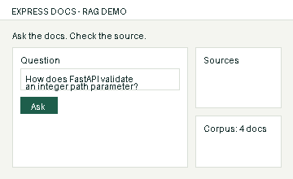
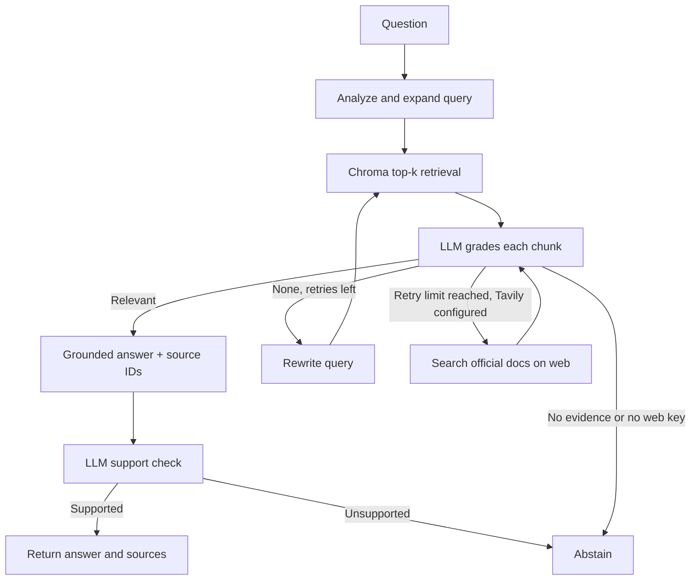

# Technical Documentation Assistant

[](https://github.com/divbytes-prog/intern-assignment/actions/workflows/tests.yml)

## Quick demo



The short walkthrough is committed as a lightweight repository asset and can be
regenerated with `scripts/make_demo_gif.py` after installing Pillow. It highlights
the normal reviewer flow: ask a question, inspect cited evidence, and open the
compact pipeline trace. The trace exposes only pipeline metadata (retrieval,
grading, citations, and verification), not hidden model reasoning.

A small, self-corrective RAG service for technical documentation. Built for the
Express Analytics AI/ML Engineer Intern assignment. It indexes four original
FastAPI study notes, retrieves semantically similar chunks with Chroma, grades
every retrieved chunk using an LLM, retries weak retrieval, and produces
source-marked answers through FastAPI. The local app also includes a small
browser interface for asking questions, inspecting sources, uploading notes,
and leaving feedback.

The included corpus is original study notes with links to the [official
FastAPI docs](https://fastapi.tiangolo.com/tutorial/). The API also accepts
additional Markdown, text, HTML, or supported documentation URLs.

## Assignment coverage

| PDF requirement | Implementation |
| --- | --- |
| 3-5 technical documents | Four original FastAPI notes in `corpus/`, with an official URL for each |
| LangGraph StateGraph | Query analysis, Chroma retrieval, LLM document grading, bounded rewrite, generation, support verification, and fallback in `app/workflow.py` |
| Grade every chunk and filter irrelevant ones | One JSON model request returns a judgment keyed by each retrieved chunk ID; missing judgments fail closed |
| Conditional routing and retry limit | Relevant chunks go to generation; otherwise rewrite and re-retrieve at most twice, then abstain |
| Ingestion, chunking, embeddings, vector store | `scripts/seed.py`, `app/ingest.py`, and `app/store.py`; local FastEmbed vectors and persistent Chroma |
| Four API endpoints | `POST /query`, `POST /ingest`, `GET /documents`, `POST /feedback` |
| Grounded response with citations | Generation uses only graded chunks; source markers or the explicit `sources` list identify cited documents, and a separate LLM node reviews support |
| Hallucination check (bonus) | Citation marker validation plus a separate answer-support LLM node; unsupported answers abstain |
| Web search fallback (bonus) | After local retries, optional Tavily search limited to three official documentation hosts; results are graded and verified like local chunks |
| Conversation memory (bonus) | UUID session ID, four recent turns in SQLite, follow-up query resolution; only retrieved sources can support an answer |
| Streamlit frontend (bonus) | `streamlit_app.py` provides chat, citations, upload, indexed documents, feedback, and new conversation |
| Optional browser interface | `GET /` serves a same-origin browser UI; `/docs` remains the interactive API |

## Architecture



The `RAGState` in `app/workflow.py` carries the original and resolved follow-up question, short session context, current
search query, query type, attempt count, retrieved chunks, filtered relevant
chunks, answer, citations, verification result, and status. One initial local retrieval plus two retries
is the default maximum. A failed relevance check never reaches generation.
The default Groq workflow uses four chat calls on a successful
single-pass question: query analysis, batch grading, answer generation, and
support checking. The optional Gemini provider retries one short per-minute
quota error after the suggested delay. Other provider quota limits return
HTTP 429, and additional retries can cost more requests.

## Requirements and setup

- Python 3.11 or newer
- A Groq API key from [Groq Console](https://console.groq.com/keys) for
  `openai/gpt-oss-20b` (subject to your free-plan limits)
- Internet for the first local embedding-model download and Groq calls;
  subsequent embedding calculations and the Chroma index are local

```bash
python -m venv .venv
source .venv/bin/activate      # Windows PowerShell: .venv\Scripts\Activate.ps1
python -m pip install -r requirements.txt
cp .env.example .env           # Windows: copy .env.example .env
```

Replace the placeholder `GROQ_API_KEY` in the local `.env` file with your
Groq API key. Both the seed script and application load `.env` automatically.
The `.env` file is excluded from Git; keep your key out of GitHub and chat messages.

Groq supplies the language model; FastEmbed's `BAAI/bge-small-en-v1.5` supplies
384-dimensional embeddings on your machine. You can optionally set
`AI_PROVIDER=gemini` or `AI_PROVIDER=openai` with the corresponding key.
`EMBEDDING_PROVIDER` can separately be `local`, `gemini`, or `openai`.
Use a **fresh `RAG_DATA_DIR`** when changing embedding models or providers;
vector dimensions and meaning may differ. The new default `./data-local`
keeps the old Gemini index in `./data` separate. The first seed downloads
the local model once (about 67 MB); later runs reuse the cache.

```bash
python -m scripts.seed
uvicorn app.main:app --reload
```

Open `http://127.0.0.1:8000/docs` for the interactive API. The Chroma index
and SQLite feedback store live in `./data-local` and persist across restarts. Seed
is idempotent: it replaces chunks with the same source URL.

For the visual interface, open `http://127.0.0.1:8000/`. It calls the same API
and does not place the provider key in the browser. If you edit any bundled
note, run `python -m scripts.seed` again to replace its indexed chunks.

On Windows PowerShell, the equivalent setup avoids activation-script policy
issues:

```powershell
py -m venv .venv
.\.venv\Scripts\python.exe -m pip install -r requirements.txt
Copy-Item .env.example .env
# Edit .env locally and replace the GROQ_API_KEY placeholder.
.\.venv\Scripts\python.exe -m scripts.seed
.\.venv\Scripts\python.exe -m uvicorn app.main:app --reload
```

### Optional bonuses

Set `TAVILY_API_KEY` in `.env` to enable the web fallback. Obtain it from
[Tavily](https://docs.tavily.com/documentation/api-reference/endpoint/search).
When local retrieval has no relevant chunks after bounded retries, the graph
makes at most one Tavily call. It requests up to three short excerpts from
`fastapi.tiangolo.com`, `docs.pydantic.dev`, and `docs.python.org`, then checks
actual URL hosts again, grades the excerpts, generates a cited answer, and
performs the same support check. A missing key simply leaves this fallback
disabled. API errors return a safe 502/429; no unverified web excerpt is
returned as an answer. Tavily is a separate provider and may have its own
quota; no key is included in this repository.

To run the Streamlit chat interface, install its additional dependency and
start it in a **second** terminal while FastAPI is running:

```bash
python -m pip install -r requirements-ui.txt
python -m streamlit run streamlit_app.py
```

Windows PowerShell: ` .\.venv\Scripts\python.exe -m pip install -r requirements-ui.txt `
then ` .\.venv\Scripts\python.exe -m streamlit run streamlit_app.py `.
The default API URL is `http://127.0.0.1:8000`; override it with
`RAG_API_URL` if needed. The Streamlit and built-in browser interfaces both
reuse the API session ID for follow-ups and provide a new-conversation action.
Session history is stored locally in SQLite and trimmed to four turns per
UUID. The history helps resolve a question like “What about integers?” but
never appears as evidence in generation; the supporting text still comes from
graded local or official web excerpts. Anyone with a session UUID can reuse
that local session; deploy behind authentication before exposing it publicly.

## API examples

```bash
curl -X POST http://127.0.0.1:8000/query \
  -H 'Content-Type: application/json' \
  -d '{"question":"How does FastAPI validate an integer path parameter?"}'
```

Representative response (model wording and ID vary):

```json
{
  "answer_id": "dce703d0-01be-49ae-836b-85e9a1785c18",
  "session_id": "aa3a3048-d402-4e48-9052-2dd5e595ea5d",
  "answer": "Annotate the route parameter as int so FastAPI parses and validates it [S1].",
  "sources": [{
    "marker": "S1",
    "title": "FastAPI path parameters",
    "source": "https://fastapi.tiangolo.com/tutorial/path-params/",
    "chunk_id": "7f9d...:0"
  }],
  "status": "answered",
  "retrieval_attempts": 1,
  "retrieval_mode": "local",
  "trace": [
    "Query analyzed for retrieval.",
    "Local retrieval completed in 1 attempt.",
    "1 chunk passed relevance grading.",
    "1 source cited in the answer.",
    "Support verification passed."
  ]
}
```

Other endpoints:

```bash
curl -X POST http://127.0.0.1:8000/ingest \
  -H 'Content-Type: application/json' \
  -d '{"url":"https://fastapi.tiangolo.com/tutorial/query-params/"}'
curl -X POST http://127.0.0.1:8000/ingest -F 'file=@my-notes.md'
curl http://127.0.0.1:8000/documents
curl -X POST http://127.0.0.1:8000/feedback \
  -H 'Content-Type: application/json' \
  -d '{"answer_id":"dce703d0-01be-49ae-836b-85e9a1785c18","rating":"up","comment":"Useful"}'
```

For a follow-up, pass the returned session ID in the next `/query` JSON
body, for example `{"question":"What if it is not an integer?", "session_id":"aa3a3048-d402-4e48-9052-2dd5e595ea5d"}`.
Omit it to begin a fresh session. The `retrieval_mode` value is `local`,
`web`, or `none` (when no usable source was found).

`/query` returns an explicit `insufficient_context` status and no sources
when the graph cannot establish relevance after its bounded retries, when
generation lacks valid citations, or when the support check rejects its claims.
Input validation errors return HTTP 422. Provider quota exhaustion returns
HTTP 429 with a safe category and provider status, without exposing key values.
`/ingest` supports JSON URLs,
multipart URL fields, or one .md/.txt/.html upload. It limits content to 1 MB
and URL fetching to three official documentation hosts to avoid arbitrary
server-side requests. `/feedback` accepts `up` or `down` for a known
`answer_id`; subsequent feedback replaces the previous vote.

## Evaluation

The repository includes a small human-authored evaluation set in
`evaluation/cases.json`. It checks answerability, expected source selection,
grounded citations, follow-up memory, and abstention on an out-of-domain
question. `scripts/evaluate.py` runs those cases against the real application
with a fresh local Chroma index and the configured Groq model:

```bash
python -m scripts.evaluate --output evaluation/latest.md
```

The checked-in `evaluation/latest.md` records the most recent completed
seven-case live run: 7/7 cases passed on 29 September 2026, including six
answers with the expected source and one out-of-domain abstention. The
[GitHub Actions run](https://github.com/divbytes-prog/intern-assignment/actions/runs/36616718545)
provides the execution record. These results are a
compact project regression set, not a claim of benchmark-level model accuracy;
provider behavior may vary in later runs.

## Design decisions and tradeoffs

- **Chunking:** Paragraph-first chunks of at most 1,200 characters; only long
  paragraphs are split with 160-character overlap. This keeps technical
  statements and adjacent headings mostly together and avoids excessive
  duplication on short notes. A more complex corpus would benefit from
  Markdown-aware section paths and token-based chunking.
- **Embeddings:** FastEmbed `BAAI/bge-small-en-v1.5` runs locally by default;
  Chroma stores the resulting vectors. Its 384 dimensions and modest model
  download make a small documentation corpus practical without an embedding
  API quota. Gemini Embedding 2 and OpenAI embeddings remain optional.
  Each chunk passed to Gemini Embedding 2 is a separate `Content` object.
- **Grading and correction:** One LLM call grades every retrieved chunk
  independently by ID. This reduces free-tier requests. If
  none is relevant, the graph rewrites and retrieves again, for at most three
  total retrieval attempts. This makes the decision inspectable but costs more
  calls and may misclassify a borderline chunk.
- **Grounding:** Generation sees only graded chunks and is asked for inline
  source markers. If a model lists valid citations but omits the inline syntax,
  one model retry can repair the citation placement. If the retry still omits
  inline markers, the API's explicit `sources` list gives references to the
  cited documents. An independent LLM check then evaluates every claim against
  **only those cited excerpts**. Failure
  causes abstention. The support checker reduces risk but can still make
  errors; it is not a formal proof.
- **Persistence:** Chroma stores the indexed chunks; SQLite stores answer IDs,
  feedback, and four recent turns per session. It is appropriate for a local single-process demo, not a
  multi-worker production deployment.
- **Assumptions:** A 1 MB limit and curated HTTPS host allowlist are sufficient
  for this technical-docs demo. Public authentication, rate limiting, and
  multi-tenant separation are outside the assignment scope.

The architecture separates retrieval, relevance judgment, answer writing, and
answer checking because each can fail in a different way. A nearest-neighbor
result might be about the wrong API; filtering it before generation is more
useful than merely asking the generator to be careful. A bounded rewrite loop
allows one recovery path without trapping a request indefinitely.

All four PDF bonus items are implemented. The Tavily path needs a separate
key to run live, and Groq model quotas may prevent a live demonstration.
Tests mock external services, so they establish graph behavior without
claiming live availability of either provider.

With more time I would expand the human-reviewed evaluation set, add explicit
document versioning and observability/cost metrics, support OCR/PDF ingestion,
and evaluate across more documentation projects. This is a local single-process
demo, not an authenticated public service.

## Tests

```bash
pytest -q
```

Tests cover the successful citation path, mixed relevance filtering, bounded
retries and abstention, malformed citation handling, support check, API
validation, ingestion, feedback, session isolation, bounded history, web
host filtering, fallback routing, repeated corpus seeding, safe provider error
handling, and a complete local API-to-Chroma flow with only external
embedding/model calls stubbed. CI also installs the optional UI dependencies
and uses Streamlit's native `AppTest` framework to exercise chat, citations,
follow-up session reuse, upload refresh, feedback, new-conversation reset, and
backend validation errors. These UI tests validate interaction behavior rather
than pixel-perfect rendering. Tests do not claim live provider availability.
For a live smoke test, seed the corpus and call `/query` with the example above.

### Credentialed live check on GitHub Actions

The manual **Live provider smoke test** workflow runs actual local embedding,
ingestion, retrieval, grading, answer generation, support checking, feedback,
and a session follow-up. If the optional Tavily key is present, it also makes a
real web-search request and checks the returned official hosts before the model
questions. Groq provides the live JSON model calls.

Add `GROQ_API_KEY` under repository **Settings → Secrets and variables →
Actions → New repository secret**, then open **Actions → Live provider smoke
test → Run workflow**. Optionally add `TAVILY_API_KEY` as another secret.
Read the result in the workflow job; the script prints pass/fail stages,
not keys, excerpts, or generated answer text. A `429 quota_or_rate_limit`
means the project's Groq quota currently prevents a complete live run;
check its limits in Groq Console. This workflow is manual, so routine pushes
do not consume API quota. It does not replace the local app setup or a visual
review of the Streamlit UI.

## Repository layout

```text
app/main.py       FastAPI endpoints and SQLite feedback
app/workflow.py   LangGraph state, nodes, and conditional edges
app/store.py      Chroma persistence and chunking
app/llm.py        JSON model interface
app/ingest.py     Bounded official-URL ingestion
app/web_search.py Optional Tavily fallback with host validation
app/static/       Optional browser interface
streamlit_app.py  Streamlit chat frontend
corpus/           Four original documentation notes and source manifest
scripts/seed.py   Idempotent corpus indexer
scripts/evaluate.py Live corpus-grounded evaluation runner
evaluation/       Human-authored evaluation cases and latest reviewed report
docs/demo.gif     Short generated interface walkthrough
tests/            Graph and API/UI behavior tests
```
